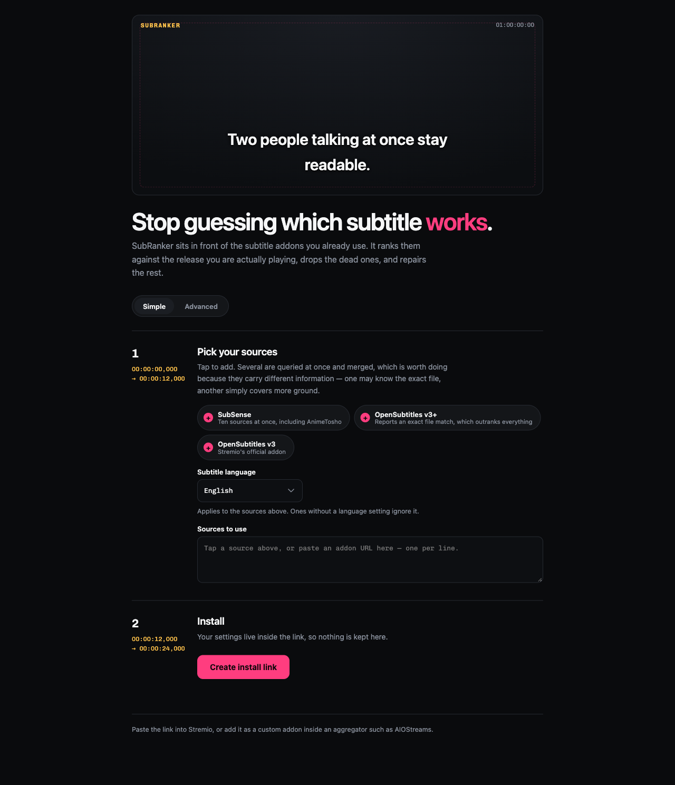

# SubRanker

[](https://github.com/iarhamanwaar/subranker/actions/workflows/ci.yml)
[](https://github.com/iarhamanwaar/subranker/pkgs/container/subranker)
[](LICENSE)

A Stremio addon that sits in front of your subtitle addons and makes the list
usable: it ranks candidates against the release you are actually playing,
removes the ones that are dead or wrong, repairs the ones that are fixable, and
labels every row so you can tell them apart.

Works for movies, TV and anime alike — nothing in it assumes a content type.

<p align="center">
  
</p>

## The problem

Ask a subtitle aggregator for English subtitles and you can easily get 45
results. Four things then go wrong, and every number below was measured on a
live setup rather than assumed:

**They look identical.** Stremio renders the addon's name against every row, so
forty-five results appear as forty-five copies of the same line and you pick
blind.

**Many are dead.** Roughly half of one provider's links returned 404 — from a
home connection and a datacenter alike. Choosing one is a silent failure.

**They are cut for different videos.** Three "English S01E01" tracks for the
same episode had last cues at 21:06, 23:24 and 23:36 — a 150-second spread.
Two otherwise-good ones still differed by 262ms, invisible in a list and very
visible on screen. A third was timed to the English dub, putting its first cue
at 6.2s against 25.4s for the subbed tracks.

**Some are mis-encoded.** 3 of 22 files sampled were not valid UTF-8. They
render as mojibake — `café` as `café`, Japanese as `ã‚ãŒã¦` — which reads as
a bad translation rather than a broken file.

More subtitles fixes none of that. Ranking and repair do.

## What it does

```
client → subranker → your subtitle addons → providers
             │
             └── parse · verify · score · rank · repair · label
```

1. **Parse** every candidate's release name, and the filename of the stream
   being played.
2. **Verify** the top candidates by downloading them in parallel: drop dead
   links, decode them properly, and align each cue timeline against a
   reference to measure offset and framerate drift.
3. **Score** on matched properties, modelled on Subliminal. Release group
   weighs heaviest, then source, resolution, episode, season. An exact
   file-hash match outweighs the sum of everything else. Stated disagreements
   are penalised, not merely unrewarded.
4. **Rank**, dropping clear mismatches.
5. **Repair** what is fixable: timing, advertising cues, character encoding.
6. **Label** each row so it reads `1. erai-raws 1080p (in sync)` rather than
   the addon's name repeated down the list.

## Features

### Ranking

Content type cannot be inferred from the Stremio id — Demon Slayer arrives as
a plain IMDb id yet ships fansub-style release names. So every candidate is run
through both an anime parser ([anitomy-ng](https://www.npmjs.com/package/anitomy-ng),
a WebAssembly build with no native dependencies) and a Radarr-style parser
([@ctrl/video-filename-parser](https://www.npmjs.com/package/@ctrl/video-filename-parser)),
and the higher-confidence result wins, with fields merged.

Players are often fed library-renamed files — `Demon Slayer - S01E01 - Cruelty
Bluray-1080p.mkv` names the source and resolution but no release group — so
when the release group is missing, measured timing agreement carries the
decision instead.

### Dub and SDH handling

A dub-timed track is treated as a sync failure rather than a preference: a dub
is a different vocal performance, so its cues drift against the original audio.
SDH tracks are only demoted when a non-SDH alternative survives, so an obscure
title never returns an empty list.

### Timing verification and correction

Alignment compares a candidate's cue timeline against a reference timeline
rather than against audio. No video is decoded and no bytes of the stream are
fetched, so it takes milliseconds rather than the 20–30 seconds an audio-based
aligner such as ffsubsync needs. The usual framerate ratios (23.976 ↔ 25 ↔ 24)
are tried, so subtitles that *drift* are distinguished from ones that are
merely *late*.

With `AUTO_SHIFT`, the measurement is then applied — `corrected = original *
rate + offset` — and the corrected file is served in place of the original. The
rate term is the one that matters: a framerate mismatch drifts progressively
and no amount of delay adjustment in the player can fix it.

Two safeguards, both learned the hard way:

- **The anchor must command a majority.** Picking the most central timeline
  says nothing about whether a consensus *exists*; with every candidate a
  different cut, the "best" reference is still one nobody agrees with. Below a
  majority, alignment is skipped entirely.
- **A non-1 rate must win by a margin.** Stretching a timeline by 4.2%
  manufactures enough coincidences to beat the truth, so the identity
  hypothesis is preferred unless drift is clearly better.

A shift is only applied when it is believable: within 30 seconds, and backed by
real agreement. A 134-second "correction" is not a lag, it is a different cut,
and sliding the timeline would only hide that.

### Advertising removal

Providers inject promotional cues into the files they serve. Detection is
conservative — a known promotional pattern **and** a position within 90s of
either end — so mid-film dialogue mentioning a website survives.

### Character-encoding repair

Two faults are handled. **Legacy encodings** (Windows-1252, Shift_JIS, CP1256,
Big5, EUC-KR and others): every legacy decoder produces output for any bytes,
so candidates are scored for plausibility rather than trusting any one.
**Double encoding**, where the file is valid UTF-8 but its text was already
mangled upstream; the reverse mapping uses Windows-1252 rather than Latin-1,
because `don’t` mangles to `don’t` whose `€` and `™` are above U+00FF and
cannot be expressed in Latin-1 at all. A repair is kept only when it makes the
text more plausible, since the same operation on correct text destroys it.

### Cue-text cleanup

Three repairs borrowed from what Bazarr has settled on, applied to the file we
already rewrite.

**Hearing-impaired removal** strips `[DOOR CREAKS]`, `(SIRENS WAIL)` and
`DOCTOR:` speaker labels, dropping cues that contain nothing else. An SDH track
then becomes an ordinary subtitle, which matters on titles where SDH is all
there is. Off by default, since it rewrites dialogue.

A speaker label is only recognised when words follow it **on the same line**.
Without that rule a title card — `EPISODE 1:` above `CRUELTY` — is read as a
speaker and silently deleted, which an audit against real files caught.

**Uppercase** is judged over the whole file rather than per line: one shouted
line is emphasis, a whole file in capitals is a transcription style.

**OCR repair** fixes the characters optical recognition confuses (`l`/`I`,
`rn`/`m`). Every rule is anchored to a word context; unanchored substitution
would rewrite real words, which is worse than the damage it repairs.

ASS/SSA files are left untouched throughout — their cues carry typesetting that
line-level rewrites destroy, which is the standing complaint against Bazarr's
own HI removal ([bazarr#2175](https://github.com/morpheus65535/bazarr/issues/2175)).

### Overlapping cues

When two cues are on screen at once — a sign and a line of dialogue, or two
characters speaking together — a player that draws both in the same place
renders them on top of each other and neither can be read. The usual cause is
conversion: in ASS the sign carries a `\pos` tag putting it at the top of the
frame, and converting to SRT throws that away.

The timeline is split at every boundary and the text of whatever is active in
each span is combined, so nothing is discarded and both lines appear for
exactly as long as they were meant to. Simultaneous *speech* additionally takes
the conventional one-dash-per-speaker form:

```
- Get back!
- I can't!
```

which is applied only when every line reads as dialogue, so a sign stacked
above speech is left as plain text.

Measured on Demon Slayer: one provider's files overlapped on every episode
checked (1, 4, 2, 7 and 3 occurrences across S01E01/02/06/07/12) while every
other source was clean — the fault is in the file, not the player.

### Forced tracks

A forced track covers only signs and foreign dialogue, and looks broken if
picked by mistake — long silences, then one line. Two independent signals are
used, because neither is reliable alone: the release name, and cue density
(a 100-minute film with 40 cues is not a dialogue track whatever it is called).

### Several upstreams

`UPSTREAM_BASE` accepts a comma-separated list, queried in parallel and merged,
deduplicated on URL, with ids namespaced per upstream. A failing upstream
degrades the list rather than emptying it.

The motivation is metadata, not volume: some providers report `moviehash` — the
exact-file signal that outweighs everything else in scoring — while aggregators
cover far more sources but report no hash. Querying both gets the breadth of
one and the certainty of the other.

## Telling rows apart

Some clients label every subtitle row with the **addon's** name and ignore the
per-subtitle `label` field, so a list of six results shows six identical rows.
Measured on Stremio Android TV 1.10.4: embedded tracks from the video file do
render their own names ("Full Subtitles", "Signs & Songs"), so the capability
exists — it simply is not wired to `label` for addon-supplied tracks
([stremio-core#907](https://github.com/Stremio/stremio-core/issues/907) tracks
this).

Until that changes, the only way to get distinguishable rows is for them to
come from different addons. The configure page can emit one install link per
ranked position:

```
/c/<config>/r/1/manifest.json   ->  "SubRanker 1 · best match"
/c/<config>/r/2/manifest.json   ->  "SubRanker 2"
```

Each instance serves exactly its own position. The names describe the position
rather than the release, because a manifest is fetched at install time and not
per playback — no addon can show the actual release name this way.

## Setup

### Docker

```bash
docker run -d --name subranker -p 7010:7010 \
  -e UPSTREAM_BASE="https://your-subtitle-addon/en" \
  -e PUBLIC_URL="https://subs.example.com" \
  ghcr.io/iarhamanwaar/subranker:latest
```

Or with compose:

```bash
curl -O https://raw.githubusercontent.com/iarhamanwaar/subranker/main/docker-compose.yml
UPSTREAM_BASE="https://your-subtitle-addon/en" docker compose up -d
```

Images are built for `amd64` and `arm64`, so a Raspberry Pi or a Graviton
instance works without a local build.

`PUBLIC_URL` matters as soon as you enable timing repair: corrected subtitles
and the addon icon are fetched by the client at an absolute URL, so the
instance has to know its own address.

Put a reverse proxy in front for TLS — Stremio refuses plain HTTP for anything
that is not localhost.

### From source

Requires Node 20+.

```bash
pnpm install
cp .env.example .env     # set UPSTREAM_BASE
pnpm build && pnpm start
```

Then open `https://your-host/configure`, fill in your upstreams, and install
the link it gives you. Settings are encoded into that URL, so one deployment
serves everyone and nothing is stored server-side. `UPSTREAM_BASE` still works
as a default for the bare `/manifest.json`.

It can also be added as a custom addon inside an aggregator, though installing
it directly is a little faster and guarantees the ordering survives.

> **Never commit your `UPSTREAM_BASE`.** Addon URLs frequently embed API keys
> in their config segment.

## Configuration

| Variable | Default | Purpose |
|---|---|---|
| `UPSTREAM_BASE` | *(required)* | Upstream subtitle addon(s), without `/manifest.json`. Comma-separated for several |
| `PORT` | `7010` | Port to listen on |
| `HOST` | `127.0.0.1` | Address to bind. The Docker image sets `0.0.0.0` |
| `PUBLIC_URL` | *(none)* | Public origin of this instance. Required by `AUTO_SHIFT` |
| `ADDON_NAME` | `SubRanker` | Name reported in the manifest |
| `VERIFY` | `true` | Download top candidates to check liveness, encoding and timing |
| `VERIFY_LIMIT` | `15` | How many to download per request |
| `VERIFY_TIMEOUT_MS` | `2500` | Per-file download timeout during verification |
| `AUTO_SHIFT` | `false` | Serve timing-corrected subtitles in place of drifting ones |
| `DROP_MISMATCHES` | `true` | Remove mismatches instead of ranking them low |
| `MAX_RESULTS` | `0` | Cap on returned subtitles; `0` means no cap |
| `REMOVE_HI` | `false` | Strip hearing-impaired annotations and speaker labels |
| `FIX_UPPERCASE` | `true` | Convert all-capitals files to sentence case |
| `FIX_OCR` | `true` | Repair `l`/`I` and `rn`/`m` confusion |
| `FIX_OVERLAPS` | `true` | Merge cues that share screen time |
| `DEMOTE_FORCED` | `true` | Rank signs-only tracks below full subtitles |
| `RELABEL` | `true` | Rewrite `lang` as well as `label`. See the note below |
| `CACHE_TTL` | `3600` | Seconds to cache a computed response |
| `PROBE_LABELS` | `false` | Diagnostic: return one row per candidate label format |

### A note on `RELABEL`

Stremio's subtitle type carries both a `lang` and a `label`
([stremio-core](https://github.com/Stremio/stremio-core/blob/development/src/types/resource/subtitles.rs)).
SubRanker always sets `label`, which is free text and is what makes rows
distinguishable.

`RELABEL` additionally rewrites `lang`. That is **off by default and generally
a bad idea**: the Android TV client maps `lang` through a language dictionary
and renders an **empty row** for anything it does not recognise, so a
descriptive `lang` disappears entirely. `PROBE_LABELS=true` exists to find out
what your own client does — it returns the same subtitle once per candidate
format, and whichever rows appear are the formats that client will render.

### A note on clients

Stremio can append `videoHash`, `videoSize` and `filename` to subtitle
requests, and those extras are what make exact matching possible. Not every
client sends them — the Android TV and web clients were reported to omit the
segment ([stremio-addon-sdk#221](https://github.com/Stremio/stremio-addon-sdk/issues/221)),
though it is fixed in current Android TV builds. SubRanker degrades
gracefully: without extras it still prunes dead links, removes dub-timed
tracks, repairs encodings, verifies timing and labels rows. With them, ranking
becomes exact.

## Performance

A cold request costs roughly 3–4 seconds, almost entirely network; responses
are cached for `CACHE_TTL` afterwards. Measured breakdown:

| Stage | Time |
|---|---|
| Upstream fetch (parallel) | 0.6–1.9s |
| Verification downloads | 2.4–2.7s |
| Parse, score, rank | 1–36ms |

Two things dominate, and neither is computation:

**Straggler downloads.** Per-file latency measures median 414ms and p90 897ms,
so the per-file timeout is 2.5s rather than something generous — a file slower
than that is marked unverified rather than dropped, so it still reaches the
client while no longer holding up the response.

**Alignment used to.** Comparing two cue timelines was a full cross product,
~300×300 per pair, run across every pair of candidates to pick the consensus
anchor — around 30M iterations, which cost about 6 seconds. Both timelines are
sorted, so the reference cues within the offset window form a contiguous run;
walking it with two pointers made the stage effectively free.

## Development

```bash
pnpm test        # unit tests
pnpm typecheck
pnpm dev         # watch mode

UPSTREAM_BASE=… pnpm exec tsx scripts/e2e.ts          # run against a live addon
UPSTREAM_BASE=… pnpm exec tsx scripts/label-check.ts  # preview the row labels
UPSTREAM_BASE=… pnpm exec tsx scripts/shift-check.ts  # inspect proposed shifts
```

Fixtures throughout the test suite are real release names and real failure
modes observed in live responses, not invented examples.

## License

MIT
